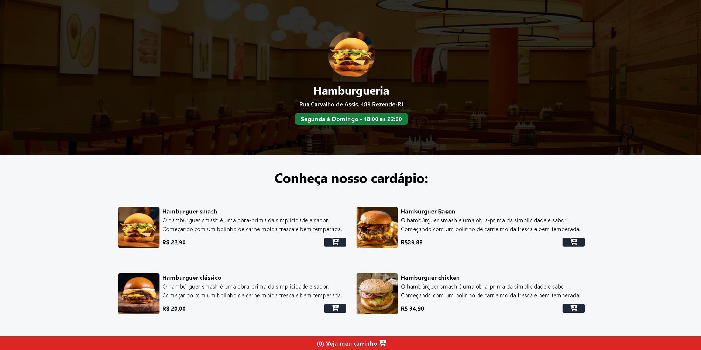
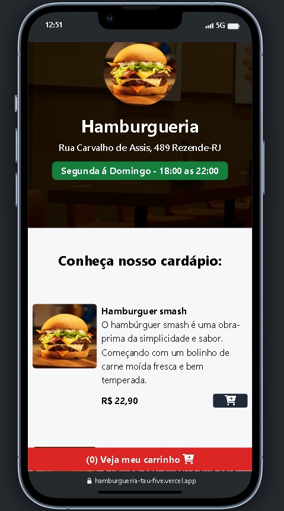

<h1 align="center">Online food menu🍔</h1>

This application is a online food menu, where users can place their order and send it directly to the fast food WhatsApp
. 100% responsive app for any devices.

    
    

# Technologies

                
<h2>🚀 Getting Started</h2>

<h4>Prerequisites</h4>

- Node(any version)
 
- TailwindCSS

<h4>Install project</h4>

git clone https://github.com/arthurdavidonisrd/hamburgueria.git
 
npm install

<h4>Install TailwindCSS</h4>

-npm install -D tailwindcss
 
-npx tailwindcss init

<h4>Initialize Tailwind</h4>

-Type in your cmd in the project directory: npm run dev
